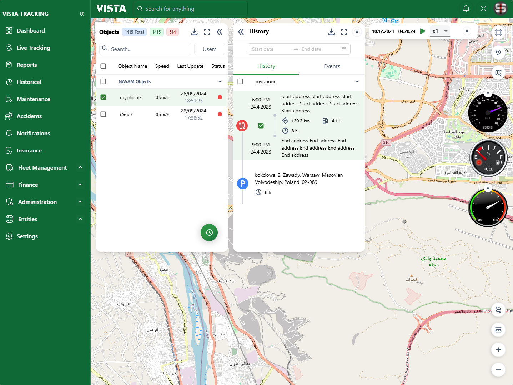

# Project Documentation: Fleet Management System with History Playback Feature

Project Overview:
The Fleet Management System is designed to help users monitor and track the real-time location and movement of vehicles in a fleet. The system provides features like live tracking, historical data visualization, and a playback mechanism to view the movement of vehicles over a period. The playback feature allows users to pause, play, fast-forward, and rewind historical data.

# Setup Instructions

1. Dependencies:

- React: Core library for building the user interface. v-^18.3.1
- Leaflet: For map rendering and handling the real-time vehicle tracking. leaflet v-^1.9.4 & react-leaflet v-^4.2.1
- Material-UI & Ant design : Used for dropdowns, buttons, and other UI components. mui v-^6.1.1 & antd v-^5.21.1
- react-icons: Used to display play/pause icons in the playback bar. v-^5.3.0
- axios: used for fetching APIs v-^1.7.7

2. Installation steps

- git clone https://github.com/OmarSalem123/Fleet-Management-System.git
- cd Fleet-Management-System
- npm install
- update .env with the real api and credentials file like the example provided in my root folder
- open http://localhost:3000/liveTracking or click on liveTracking from the dashboard

# Usage Guidelines:

1. User Interface Overview:

Left Sidebar:
Provides navigation options for live tracking, historical tracking, reports, maintenance, and more.

Map View:
Displays real-time or historical positions of vehicles using Leaflet. Markers indicate the current location of the vehicles, and polylines show the vehicle's route.

Objects Card (Left Panel):
Lists all active devices. Clicking on any device shows its details and allows users to open the History Card.

Right Sidebar (Meters and Gauges):
Shows meters for vehicle data such as speed, fuel, and engine status when a device is selected.

Playback Bar (History Playback Feature):
Located at the bottom of the screen, this provides playback controls such as play, pause, rewind, fast-forward, and speed adjustments. This bar is visible when a device is selected for historical playback.

2. Playback Component:
   The Playback component provides the following controls:

Play/Pause: Start or stop playback of the historical data.
Speed Selector: Adjust the speed of playback (x0.5, x1, x1.5, x2, etc.).
Rewind/Fast Forward: Navigate through the recorded positions manually.
Close Playback: Closes the playback bar and resets the UI.

3. Data Fetching:
   The app uses the Traccar API to fetch both real-time and historical vehicle positions. Here’s how the components interact with the API:

fetchVehiclePositions: Fetches positions within a specified time range (used in the HistoryCard and LiveTracking components).
fetchDevices: Retrieves all devices (vehicles) and displays them in the ObjectsCard component.

# Component Breakdown:

1. LiveTracking Component:
   This is the main container that displays the map and manages the vehicle positions. It interacts with:

MapContainer: Leaflet container displaying vehicle markers.
ObjectsCard: A component that lists all tracked objects.
Meters Component: Displays meters when a vehicle is selected. 2. ObjectsCard Component:
Handles the list of devices and communicates the selected device to the HistoryCard and LiveTracking components.

3. HistoryCard Component:
   Displays the historical data for the selected vehicle, allowing users to choose a date range and see playback controls.

4. Playback Component:
   Handles the playback of historical data, including controlling the speed of playback and switching between playing and paused states. The parent component receives the isPlaybackOpen state from here to adjust the UI layout dynamically.

# Final output

